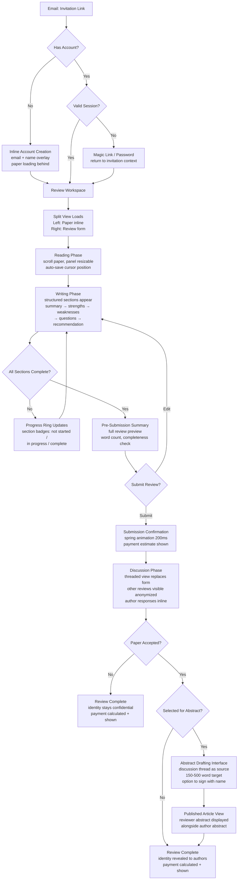
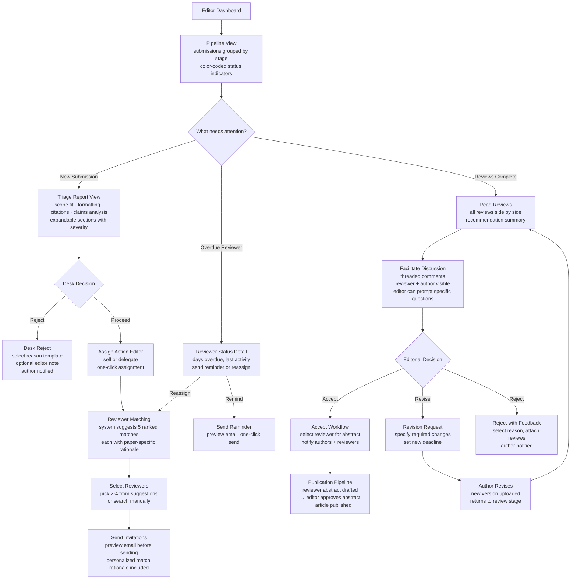
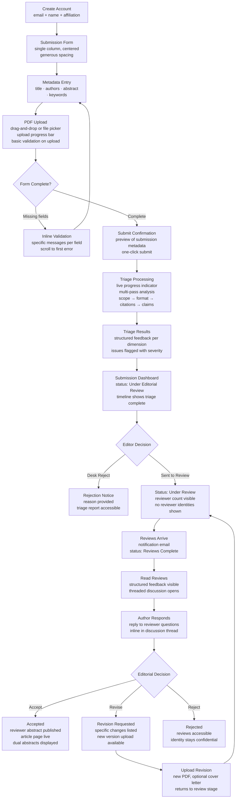
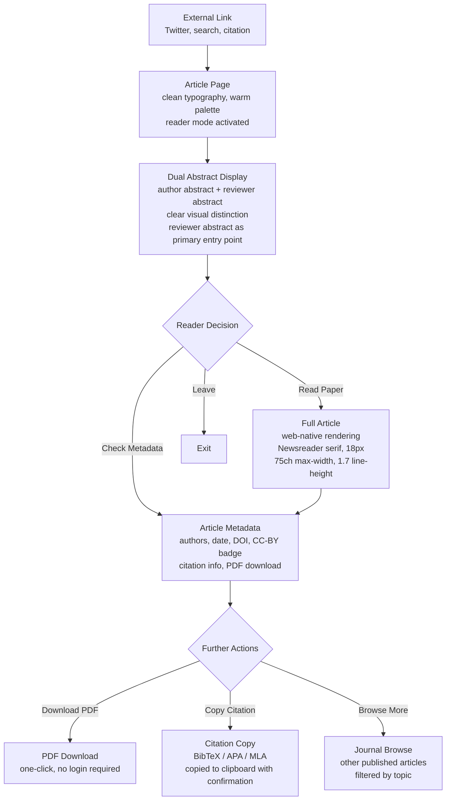

# UX Design Specification alignment-journal

**Author:** Luca
**Date:** 2026-02-07

---

## Executive Summary

### Project Vision

A prototype editorial platform for the Alignment Journal — a new academic venue for theoretical AI alignment research. Built as a 1-week founding engineer application for evaluation by the founding editors (Jess Riedel, Dan Mackinlay). The platform demonstrates a complete submission-to-publication pipeline with mechanisms that don't exist in current editorial software: LLM-powered desk triage, paid peer review with multi-factor incentive design, reviewer abstracts published alongside papers, and semi-confidential review with configurable post-decision identity disclosure. The prototype must feel like a functioning journal, not a wireframe — and convince domain experts within 10 minutes of exploration that this person should build their platform.

### Target Users

**Reviewer (Elena archetype):** Senior research scientist at a frontier AI lab. Deep in agent foundations and decision theory, perpetually overcommitted, burned out on conference reviewing. Motivated by real pay ($500-$1,500), paper-expertise match quality, and professional reputation via signed reviewer abstracts. Critical UX need: invitation link to reading paper in under 60 seconds with minimal onboarding.

**Editor (Jess archetype):** Founding editor managing 10-30 active submissions across all pipeline stages. Needs instant pipeline visibility — what's stuck, who's slow, which papers need action. Relies on LLM triage reports to inform desk-reject decisions without reading full papers. Manages reviewer assignment, progress monitoring, decisions, and audit trails.

**Author (Marcus archetype):** Independent alignment researcher submitting theoretical work too abstract for ML conferences and too technical for online forums. Wants fast automated triage feedback (minutes, not weeks), submission status visibility, and institutional legitimacy from peer-reviewed publication.

**Public Reader:** Discovers published articles via social media or search. The dual-abstract display (author + reviewer) is the primary reading entry point. Needs clean web-first typography and immediate access to article metadata, PDF download, and citation info.

### Key Design Challenges

1. **Semi-confidential identity mechanics:** Multi-layered information architecture where the same submission context shows different identity information to different roles (authors, reviewers, editors), with disclosure rules that change based on accept/reject outcome. Getting this wrong undermines the trust model the journal is built on.

2. **Actionable LLM triage output:** Triage reports must compress multi-dimensional analysis (scope fit, formatting, citations, claims) into a scannable format that genuinely informs editorial decisions. Must avoid becoming noise that editors learn to ignore.

3. **Reviewer onboarding friction:** The path from invitation email to reading the paper must be near-frictionless — minimal account creation, no unnecessary navigation, paper loaded inline. Every extra step is a dropout risk for overcommitted senior researchers.

4. **Dense pipeline visibility:** Editor dashboard must convey 10-30 submissions across 7+ status stages, each with multiple reviewers at different response states, without overwhelming. Requires careful information density and visual hierarchy.

### Design Opportunities

1. **Dual-abstract reading experience:** The reviewer abstract alongside the author abstract on published articles is a genuinely novel UX pattern. Designing clear visual hierarchy between author and reviewer perspectives demonstrates the journal's core value proposition in seconds.

2. **Transparent incentive mechanics:** Real-time payment calculation visibility (base + quality multiplier + speed bonus + abstract bonus) serves as both information and motivation. Making the compensation formula tangible and understandable is a UX differentiator for reviewer recruitment.

3. **Live triage as demonstration centerpiece:** Real-time progressive reveal of LLM analysis passes creates an immediate "this is different" moment for evaluators. Designing this as a live experience rather than a static report amplifies prototype impact.

## Core User Experience

### Defining Experience

The reviewer invitation-to-review flow is the defining interaction. Everything radiates outward from this: if an overcommitted senior researcher clicks an invitation link and is reading the paper within 60 seconds — account creation invisible, no dashboard navigation, structured review form ready when they are — the platform has proven itself. The editor dashboard and published article pages are critical, but the reviewer flow is where the prototype earns trust.

The core loop: Invitation link → instant paper access → structured review → threaded discussion → reviewer abstract → payment visibility. Every step removes friction that existing platforms impose.

### Platform Strategy

**Desktop-first web application.** Mouse/keyboard primary interaction. No mobile optimization for prototype scope. Modern evergreen browsers.

**Unified system, distinct modes.** The platform is one product with a shared design language — consistent typography, color system, spacing, and interaction patterns — but each role enters a distinct "mode" tuned to their task. The reviewer lands in a focused reading-and-writing environment. The editor enters a pipeline command center. The author sees a clean submission and tracking interface. The reader encounters a publication page. Navigation between modes exists but is quiet — each mode is optimized for its purpose without forcing awareness of the whole system.

**Demo-real balance.** The prototype should feel like a functioning journal that happens to have seed data, not a guided demo. But it needs subtle affordances: role-switching capability so evaluators can experience all four perspectives, seed data that tells a coherent story across pipeline stages, and enough content density that the platform feels inhabited rather than empty. No tutorial overlays or walkthrough modals — the UI should be self-evident. A small persistent role-switcher (perhaps in the header or sidebar) lets Jess and Dan fluidly move between Elena, Jess, Marcus, and reader perspectives.

### Effortless Interactions

**Reviewer onboarding:** Invitation link → reading paper. Zero navigation. Account creation is inline and minimal (email + name). The paper loads immediately. The review form appears when the reviewer is ready, not before.

**Editor triage consumption:** Open dashboard → see what needs attention. No clicking into individual submissions to understand status. The pipeline view surfaces actionable information at the list level. Triage reports are scannable — structured sections with severity indicators, not prose paragraphs.

**Status comprehension:** For any submission, any authorized user should understand its current state within 2 seconds of looking at it. Color-coded status, reviewer response indicators, and time-in-stage signals do the work.

**Role switching (demo affordance):** One click to see the platform as a different user. The transition should feel like changing seats at the same table, not logging into a different app.

### Critical Success Moments

1. **"This is different" moment (first 30 seconds):** When Jess opens the editor dashboard and sees a live triage report with structured, substantive analysis of a real alignment paper — not a toy demo. This is when she decides to keep exploring.

2. **"They understand our journal" moment (first 2 minutes):** When the evaluators encounter the reviewer abstract alongside the author abstract on a published article page, and the semi-confidential identity mechanics work correctly — reviewers visible to editors, hidden from authors during review, revealed on acceptance. These are the mechanisms no existing platform supports.

3. **"I could use this" moment (5 minutes in):** When the end-to-end flow coheres — submission → triage → assignment → review → discussion → decision → publication — and nothing feels like a dead end or a wireframe placeholder.

4. **"This person should build our platform" moment (10 minutes):** When 2-3 product decisions beyond what was specified reveal genuine understanding of the journal's mission. The payment calculation transparency. The reviewer matching rationale. The audit trail. Details that demonstrate the builder internalized the vision.

### Experience Principles

1. **Gravity without heaviness.** This is a serious academic platform handling rigorous research — it should feel authoritative and trustworthy. But "serious" doesn't mean "boring" or "institutional." The design carries weight through precision, not through dullness.

2. **Information density, not information overload.** The editor dashboard shows 10-30 submissions across 7+ stages with multiple reviewers each. The design earns the right to be dense by making every element scannable, using visual hierarchy aggressively, and never requiring a click to answer "what needs my attention?"

3. **Friction is a choice, not a default.** Every interaction starts from zero friction and adds steps only when they serve the user. Account creation: inline, minimal. Paper access: immediate. Review submission: structured but not constraining. The platform removes steps that competitors require by default.

4. **One system, many lenses.** The product feels unified — same design language, same quality bar — but each role's mode is tuned to its task. A reviewer never sees dashboard complexity. An editor never fights through a reading interface to find pipeline status. The system shapes itself to the user's current purpose.

## Desired Emotional Response

### Primary Emotional Goals

**Respect** is the throughline emotion across all roles. Every user should feel the platform treats their time, expertise, and attention as valuable. This manifests differently per role — for reviewers it's frictionless onboarding and visible compensation; for editors it's actionable intelligence without noise; for authors it's fast, substantive feedback instead of weeks of silence; for readers it's typography and layout that honors the research.

**Command** is the editor-specific emotion. The dashboard should feel like an instrument Jess has mastered — dense information that she navigates fluently, not a tool she's fighting. The triage reports should create confidence in decisions, not more questions.

**Conviction** is the meta-emotion for the evaluators. The prototype must move through a progression: impressed → understanding → convinced → committed. Each minute of exploration should deepen their certainty that this person should build their platform.

### Emotional Journey Mapping

**First contact (0-10 seconds):** Quiet authority. The interface loads fast, typography is sharp, layout is intentional. The immediate feeling: "someone who cares about craft built this." Subtle entrance animations signal polish without demanding attention.

**Orientation (10-60 seconds):** Clarity without simplicity. The user understands where they are and what they can do. Information architecture is self-evident. No confusion about what's clickable, what's status, what needs action. The feeling: "I know how this works already."

**Core task (1-5 minutes):** Flow state. The interface recedes and the work takes center stage — reading a paper, scanning the pipeline, writing a review. Micro-interactions confirm actions (a status chip animates on transition, a triage section reveals with a smooth expand, a review submission gets a satisfying confirmation). The feeling: "this is how it should always work."

**Completion (task done):** Accomplishment with forward motion. Submitting a review shows a clean summary with payment calculation. Making an editorial decision updates the pipeline with a fluid transition. The feeling: "done, and I know what happens next."

**Return (next session):** Recognition and continuity. The dashboard remembers context. The pipeline shows what changed since last visit. The feeling: "this picked up right where I left off."

**Error/edge cases:** Calm guidance. Errors don't feel like the system broke — they feel like the system is helping navigate. Validation messages are specific and constructive. The feeling: "I know exactly how to fix this."

### Micro-Emotions

**Confidence over confusion:** Semi-confidential identity mechanics must feel transparent in their rules, even when the rules are complex. Reviewers should never wonder "can the author see my name?" — the UI makes the confidentiality state visually unambiguous at all times.

**Trust over skepticism:** The prototype must never feel like a demo. Seed data tells a coherent story. LLM triage reports are substantive, not placeholder. The review discussion threads read like real academic discourse. Every detail reinforces "this is real."

**Delight over mere satisfaction:** Micro-interactions create moments of craft — a status transition that animates smoothly, a triage report that reveals section by section, a payment calculation that builds up visually as components are added. These aren't decorative; they communicate state changes and make the system feel alive.

**Recognition over anonymity:** Reviewers who sign the reviewer abstract get visible credit. The payment breakdown shows exactly how each factor contributed. The system acknowledges effort concretely, not abstractly.

### Design Implications

**Respect → Minimal onboarding, maximum context.** Never ask for information the system doesn't need. Pre-fill what can be inferred. Show the paper immediately on reviewer landing. Display rationale for why a reviewer was matched.

**Command → Information density with visual hierarchy.** The editor dashboard earns density through aggressive use of color-coding, typographic weight, and spatial grouping. No element is ambiguous. Status is readable at a glance without hovering or clicking.

**Conviction → Progressive revelation of depth.** The prototype's sophistication should unfold over time. Surface-level: it looks great and works. One layer deeper: the triage reports are genuinely substantive. Another layer: the reviewer matching rationale shows real understanding. Deepest: the payment formula, audit trail, and confidentiality mechanics reveal someone who internalized the journal's mission.

**Flow → Purposeful motion, Linear-style.** Micro-interactions serve information, not decoration. Transitions communicate state changes (submission moving through pipeline stages). Hover states reveal additional context without requiring clicks. Loading states use skeleton screens with subtle shimmer, not spinners. Page transitions are smooth and directional — navigating "into" a submission feels like zooming in, backing out feels like pulling back. Spring-based easing, not mechanical linear timing.

### Emotional Design Principles

1. **Motion is communication.** Every animation conveys meaning — a status change, a successful action, a new piece of information arriving. No gratuitous motion. Inspired by Linear's approach: transitions are fast (150-300ms), spring-based, and make the interface feel physically responsive. Staggered reveals on page load create a sense of the interface "assembling" with intention.

2. **Density is earned through clarity.** The editor dashboard is information-dense by necessity. Density feels empowering (not overwhelming) when every element has clear visual hierarchy: primary actions are bold, secondary information is muted, status indicators use consistent color language, and whitespace groups related items. The user's eye should flow naturally to what matters.

3. **Craft signals competence.** Every pixel of polish in the prototype signals to the evaluators: "this person builds things properly." Consistent spacing, aligned elements, considered typography, smooth interactions — these details compound into an overall impression of engineering quality that extends beyond the UI to the entire project.

4. **Quiet confidence, not loud performance.** The design doesn't shout or try to impress with flashiness. It impresses through restraint, precision, and moments of unexpected thoughtfulness — a perfectly timed animation, a piece of information surfaced exactly when needed, a layout choice that makes a complex workflow feel simple. The personality is in the details, not the spectacle.

## UX Pattern Analysis & Inspiration

### Inspiring Products Analysis

**Linear — The aesthetic and interaction benchmark**

Linear proves that dense project management software can feel fast, precise, and beautiful. Key UX successes: keyboard-first navigation that rewards power users without punishing newcomers; spring-based animations (150-250ms) that make every state change feel physical; information density that never overwhelms because visual hierarchy is ruthlessly enforced — primary actions are bold, metadata is muted, status uses a consistent color language; dark mode as the default aesthetic, treating the tool as an environment you inhabit rather than a form you fill out. The sidebar navigation is minimal — it gets out of the way. Issue detail views feel like "zooming in" rather than "navigating to a page." The overall impression: someone obsessed with craft built this.

What to extract: animation timing and easing curves, status color system philosophy, information density patterns, keyboard shortcut architecture, the feeling of "zooming into" detail views, skeleton loading states with shimmer.

**OpenReview — The anti-pattern library**

OpenReview is the most relevant direct comparison — Jess and Dan use it and know its pain points intimately. Key UX failures: cluttered layouts with inconsistent spacing; no visual hierarchy between paper metadata, review content, and discussion threads; navigation that requires understanding the system's internal model rather than the user's mental model; reviewer interfaces that feel like form-filling rather than scholarly engagement; status information buried in text rather than surfaced visually; no sense of pipeline or progress — everything exists in an undifferentiated list. The review discussion interface is particularly weak: flat comment threads with no threading, poor attribution, and no visual distinction between author responses and reviewer comments.

What to avoid: undifferentiated list views with no pipeline concept, flat discussion threads, forms that feel bureaucratic, status conveyed through text labels rather than visual indicators, interfaces that require training to understand.

What to selectively adapt: OpenReview's paper metadata display is reasonably structured (title, authors, abstract, keywords) — the content model is sound even if the presentation isn't. Their public review model (for ICLR) establishes that review content can be a first-class reading artifact — the Alignment Journal's reviewer abstract takes this further.

**Notion — The unified multi-mode reference**

Notion's core UX achievement is making multiple interaction paradigms (document editing, database views, kanban boards, calendars) feel like one coherent product. Key UX successes: a single design language that flexes across radically different use cases; the "/" command palette that surfaces capabilities without cluttering the interface; smooth transitions between views of the same data (table → board → calendar); inline editing that eliminates the edit/view mode distinction; content blocks as a universal primitive that makes everything composable. The overall impression: one tool that shapes itself to your current task.

What to extract: the principle of one design system serving multiple "modes" — directly applicable to our reviewer/editor/author/reader modes; the "/" command palette pattern for power-user acceleration; inline editing for review forms and editorial actions; the feeling of the tool reshaping itself rather than navigating between separate apps.

### Transferable UX Patterns

**Navigation Patterns:**

- **Linear's sidebar + detail view** — minimal persistent navigation (submission list, pipeline filters) with detail views that feel like zooming in. Directly applicable to editor dashboard → submission detail flow. The sidebar shows the pipeline; clicking a submission expands into full context without losing awareness of where you are.
- **Notion's mode switching** — same data, different views. The editor sees submissions as a pipeline; the reviewer sees a focused reading environment; the author sees a status tracker. Same underlying submissions, different lenses. Role-switcher in the header acts like Notion's view toggle.

**Interaction Patterns:**

- **Linear's keyboard shortcuts** — cmd+K command palette for power users (jump to submission, switch role, filter pipeline). Not required for first use, but available for the evaluators who will explore deeply.
- **Linear's inline status transitions** — clicking a status chip opens a dropdown to change status, with the transition animating smoothly. Directly applicable to editorial decisions and submission status management.
- **Notion's inline editing** — review form that feels like document composition with structured sections, not form field completion.

**Visual Patterns:**

- **Linear's color system** — status colors are semantic and consistent across the entire product. A color means the same thing everywhere. Amber always means "needs attention." Green always means "complete." Critical for the editor dashboard where 7+ status stages need instant recognition.
- **Linear's motion language** — spring-based easing, 150-250ms transitions, staggered page load reveals. Every animation is fast enough to feel responsive but present enough to communicate state changes. No animation exceeds 300ms.
- **Linear's loading states** — skeleton screens with subtle shimmer rather than spinners. Maintains layout stability and feels faster even when it isn't.

**Information Architecture Patterns:**

- **Linear's issue detail layout** — metadata in a right sidebar or header, primary content in the main area, activity/discussion below. Maps to submission detail: paper metadata and status in a sidebar, PDF in the main area, review discussion below.
- **Notion's block-based content** — triage report sections as expandable blocks, each with a severity indicator and summary. Editors can scan headings and expand only what interests them.

### Anti-Patterns to Avoid

**From OpenReview's known failures:**

1. **The identity trust gap.** OpenReview's 2025 API leak exposed reviewer identities across ICLR, NeurIPS, ICML, and EMNLP — a catastrophic breach of double-blind review. Our semi-confidential model is more complex (identity rules change per outcome), which means the surface area is larger. Response: confidentiality state must be enforced server-side and communicated visually at all times. A persistent confidentiality badge on every reviewer-facing screen ("Authors cannot see your identity"). Editor views that make privileged information visually distinct. The user should never have to wonder whether their identity is protected — the UI proves it continuously.

2. **The anonymous reviewer slot.** OpenReview treats reviewers as interchangeable — MSc students review alongside senior researchers with no visible differentiation. Our reviewer matching with explainable rationale is the antidote: each match is a considered recommendation with specific reasons ("published on corrigibility, overlapping with this paper's core argument"), not a random assignment from a pool.

3. **The unaccountable review.** OpenReview's one-shot, anonymous review process incentivizes low effort. No feedback loop, no quality signal, no accountability. Our response is multi-layered: paid review with visible quality multipliers (the reviewer sees their assessment during the process), threaded discussion that creates a conversation rather than a verdict, and the reviewer abstract as a published artifact with the reviewer's name on it. The UX must make each of these accountability mechanisms feel natural and motivating, not punitive.

4. **The noise floor.** For outsiders, OpenReview is useless — review scores are unreliable quality signals, and the volume of papers makes discovery impossible. The reviewer abstract solves this at the article level: a reader-oriented assessment from a vetted expert, displayed prominently on the published article page. The article page should make the reviewer abstract feel like the primary entry point for deciding whether to read the paper.

5. **The adversarial dynamic.** OpenReview's culture feels competitive and hostile — "publish or perish" at scale. The Alignment Journal's small scale (10-30 submissions, not 10,000) changes the fundamental dynamic. The UX should reflect intimacy: each submission gets visible attention (deep triage, specific matching rationale), the review conversation is low-friction and constructive, and the overall tone says "your work matters here."

**From general UX failures:**

6. **The OpenReview list dump.** Never present submissions as an undifferentiated list. Every list view must have visual pipeline structure — status grouping, color coding, and progress indicators.

7. **The bureaucratic form.** Review submission should feel like writing, not paperwork. No ALL CAPS labels, no rigid field-by-field progression.

8. **The notification wall.** Email simulation previews should be contextual, not dumped in a notification center.

9. **The mystery meat status.** Status must be visual first (color, icon, progress), text second (confirms what the visual communicated).

10. **The modal cascade.** Complex workflows happen in-context or slide-over panels, never stacking modals.

11. **The empty state void.** Any theoretically empty view has a purposeful empty state guiding toward the next action.

### Design Inspiration Strategy

**Adopt directly:**
- Linear's animation timing (150-250ms, spring-based easing) and skeleton loading patterns
- Linear's semantic color system for status indicators across all views
- Linear's sidebar + detail view navigation architecture for the editor dashboard
- Notion's principle of one design system serving multiple interaction modes

**Adapt for our context:**
- Linear's keyboard shortcut system → simplified cmd+K palette for role switching, submission search, and quick navigation
- Notion's inline editing → review form that feels like document composition with structured sections
- Linear's issue detail layout → submission detail with PDF viewer as primary content, metadata sidebar, discussion below
- Notion's view toggling → role-based mode switching that reshapes the interface for each user's task

**Explicitly avoid:**
- OpenReview's flat, undifferentiated list views and text-only status indicators
- OpenReview's form-heavy, bureaucratic review interface
- OpenReview's invisible confidentiality enforcement (no visual proof of identity protection)
- OpenReview's anonymous reviewer slot model (no matching rationale, no expertise visibility)
- Any loading pattern that uses spinners instead of skeleton screens
- Modal cascades for multi-step workflows
- Generic dashboard layouts that don't reflect the specific editorial pipeline

## Design System Foundation

### Design System Choice

**shadcn/ui + Tailwind CSS + Motion (Framer Motion)** — a themeable component system with full ownership, accessibility primitives, and animation capability.

shadcn/ui provides copy-paste React components built on Radix UI primitives. Unlike dependency-based libraries (MUI, Chakra), components live in the codebase and can be restyled without fighting abstractions. Tailwind CSS provides the utility layer for rapid custom styling. Motion (Framer Motion) provides spring-based animations and layout transitions for the Linear-inspired micro-interaction language.

### Rationale for Selection

1. **Timeline fit (7-day build):** shadcn/ui ships production-quality components that map directly to our needs — data tables (editor pipeline), command palette (cmd+K navigation), sheets (slide-over panels for submission detail), dropdowns (status transitions), and dialog primitives. These are days of work saved.

2. **Customization depth for "subtle edge" aesthetic:** Because components are owned (not imported from node_modules), departing from defaults is straightforward. The design can feel distinctive without fighting the component library. Critical for avoiding the generic "shadcn look" that is becoming its own form of AI slop.

3. **Accessibility by default:** Radix UI primitives provide WCAG 2.1 AA compliance — keyboard navigation, screen reader support, focus management, ARIA attributes — baked into every component. The PRD requires this for published article pages, and it's good practice everywhere.

4. **Animation integration:** Motion pairs cleanly with React and Tailwind for spring-based animations (150-250ms), staggered page load reveals, layout animations (pipeline transitions), and gesture-driven interactions. This is the foundation for the Linear-style micro-interactions we've committed to.

5. **Dark/light mode flexibility:** Tailwind's CSS variable theming combined with shadcn's built-in dark mode support makes mode-specific color distinctions straightforward to implement as a single token set with contextual overrides.

### Implementation Approach

**Component strategy:** Start from shadcn/ui defaults, then progressively customize. For the prototype timeline, customize deeply where it matters most (status chips, pipeline cards, article typography, triage report blocks) and accept polished defaults where components are functional but not differentiating (form inputs, basic buttons, dialogs).

**Key shadcn/ui components to leverage:**
- `DataTable` — editor pipeline view (submissions list with sorting, filtering, status)
- `Command` (cmdk) — cmd+K palette for role switching, navigation, search
- `Sheet` — slide-over panels for submission detail, reviewer matching, audit trail
- `Tabs` — review form sections, triage report dimensions
- `DropdownMenu` — status transitions, editorial actions
- `Avatar` — reviewer/author identity display with confidentiality-aware rendering
- `Badge` — status indicators, severity chips, role labels
- `Tooltip` — contextual information on hover (reviewer match rationale, payment component explanations)

**Animation layer (Motion):**
- `AnimatePresence` — page transitions (zoom-in to submission detail, pull-back to pipeline)
- `motion.div` with spring physics — status chip transitions, triage section reveals, staggered list loading
- `layoutId` — shared layout animations for elements that persist across views (submission card → detail header)
- Skeleton shimmer via CSS animation (no Motion overhead for loading states)

### Customization Strategy

**Unified token set with mode-specific accents.** One design system governs the entire platform — consistent typography, spacing scale, border radii, shadow system, and component patterns. Color shifts subtly per mode to create atmospheric distinction without breaking coherence.

**Mode color strategy:**

- **Editor mode (dashboard, triage, assignment):** Cooler, darker palette. Dark background (near-black or very deep slate), muted secondary surfaces, high-contrast status indicators that pop against the dark ground. The "command center" feel. Accent color: cool blue or teal for primary actions.

- **Reviewer mode (paper reading, review writing, discussion):** Neutral, focused palette. Dark or medium background for the reading environment, warm paper-white for the PDF viewing area. Reduced visual noise — the paper is the protagonist. Accent color: subtle warm shift from editor mode.

- **Author mode (submission, status tracking):** Clean, approachable palette. Lighter touch than editor mode — the author interacts less frequently and shouldn't feel intimidated. Accent color: shares the primary accent with slight warmth.

- **Reader mode (published articles):** Warmest, lightest palette. Light background optimized for extended reading — warm off-white or cream, high-contrast serif text, generous margins. This mode should feel like a well-typeset journal, not a web app. Accent color: warm, understated — the content is the focus.

**Shared across all modes:**
- Typography scale and font pairing (consistent display + body fonts)
- Spacing scale (4px base unit, consistent padding/margin ratios)
- Border radius tokens (consistent roundedness language)
- Shadow system (consistent elevation hierarchy)
- Status color semantics (green = complete, amber = attention, red = overdue — same meaning everywhere)
- Component interaction patterns (hover, focus, active states behave identically)
- Animation timing and easing (spring-based, 150-250ms, consistent across modes)

**CSS variable architecture:**

```
/* Shared tokens */
--font-display, --font-body, --font-mono
--radius-sm, --radius-md, --radius-lg
--spacing-unit (4px)
--shadow-sm, --shadow-md, --shadow-lg
--status-green, --status-amber, --status-red

/* Mode-specific overrides (applied via data-mode attribute or route-based class) */
--background, --foreground
--surface, --surface-elevated
--accent, --accent-foreground
--muted, --muted-foreground
--border, --border-subtle
```

Mode transitions apply via a `data-mode` attribute on the root layout, allowing CSS variables to shift contextually. When the evaluator switches roles, the color atmosphere shifts subtly — felt but not jarring. No flash, no theme toggle animation — just a quiet tonal shift that reinforces "you're in a different mode now."

## Defining Core Experience

### Defining Experience

**"Click a link, read a paper, write a review that becomes a published artifact — and get paid for the quality of your thinking."**

This is the sentence a reviewer tells a colleague. It captures the complete value loop in one breath: frictionless access, meaningful work, visible output, fair compensation. Every other feature in the platform exists to support this loop or to make it visible to editors, authors, and readers.

The defining experience is not a single interaction but a *flow* — invitation → reading → reviewing → discussion → reviewer abstract → payment. The flow must feel continuous, not like a sequence of separate tasks. The reviewer should never feel like they've "left" one mode and "entered" another. They're always in the same focused environment; the interface quietly evolves around their progress.

### User Mental Model

**Reviewer mental model:** Elena approaches this like a professional engagement, not a volunteer obligation. She's been hired (paid review), matched specifically (the invitation explains why), and her output has professional value (the reviewer abstract is a published artifact she can put on her CV). Her mental model is closer to "consulting engagement" than "conference duty." The platform should reinforce this: she's a valued expert being asked for her professional assessment, not an anonymous cog in a review machine.

**Current solutions and their failures:** Elena's reference point is OpenReview, where reviewing feels like unpaid bureaucracy — a form to fill out, scores to assign, rebuttals to endure. The mental model there is adversarial: reviewer vs. author, mediated by an overloaded area chair. Our platform should feel collaborative: reviewer + author + editor working toward the same goal (a well-assessed paper), mediated by a system that respects everyone's time.

**Key expectation:** Elena expects the paper to be ready when she arrives. Not "download the PDF, open it in your PDF reader, then come back to the form." The paper and the review writing environment should coexist from the first moment. She reads and writes in the same space.

**Editor mental model:** Jess thinks in terms of pipeline flow. Her mental model is: submissions arrive → get triaged → get assigned → get reviewed → get decided → get published. She wants to see this flow as a spatial metaphor — left to right, or top to bottom — with bottlenecks and stuck items visually obvious. Her reference point is more "operations dashboard" than "document management."

**Author mental model:** Marcus thinks in terms of status and feedback. He submitted something and wants to know: where is it, what's happening, and what do they think? His mental model is a tracking interface — like following a package, but for his intellectual work. The key emotion is trust: he needs to believe the system is working even when he can't see inside the review process.

### Success Criteria

**Reviewer flow success:**
- Invitation link → reading paper: under 60 seconds, including any account creation
- Paper renders inline with comfortable reading typography, not a raw PDF embed
- Review form is accessible alongside the paper (split view or tabbed) — no context switching between "reading" and "writing"
- Submitting a review feels like completing a meaningful professional task, not filing a form
- Payment calculation is visible and motivating, not hidden or confusing
- The reviewer abstract invitation feels prestigious — "you've been selected to write the published abstract for this paper"

**Editor flow success:**
- Dashboard load → understanding what needs attention: under 5 seconds
- Triage report scannable without reading full prose: structured sections with severity indicators
- Reviewer matching suggestions include specific, paper-relevant rationale — not generic similarity scores
- Status of any submission comprehensible at a glance without clicking into it

**Author flow success:**
- Submission → triage feedback: under 5 minutes (LLM processing time)
- Status always visible and honest — no ambiguous states
- Review feedback, when it arrives, feels substantive and constructive

### Novel UX Patterns

**Novel patterns we're introducing:**

1. **Dual-abstract article display.** No existing journal publishes a reviewer abstract alongside the author abstract. This is a genuinely new reading experience. The visual design must make the relationship between the two abstracts immediately clear — who wrote which, what purpose each serves — without requiring explanation.

2. **Inline paper reading + review writing.** The split-view or tabbed environment where the paper renders inline (web-native, not PDF embed) alongside the review form is uncommon in editorial software. OpenReview and most platforms treat "read the paper" and "write the review" as separate activities. We're merging them into one continuous workspace.

3. **Visible confidentiality state.** No editorial platform we've analyzed makes the identity protection rules visually explicit. Reviewers are told they're anonymous, but the UI doesn't prove it. Our persistent confidentiality badge is a novel trust-building pattern.

4. **Live payment calculation.** Showing the reviewer their compensation formula in real-time (base + quality + speed + abstract) as they progress through the review is unusual. Most paid review systems either don't exist or handle payment offline.

**Established patterns we're using with a twist:**

- **Pipeline dashboard** (established: Kanban/Linear) → twist: submissions flow through editorial-specific stages with role-aware information density
- **Threaded discussion** (established: GitHub, Slack) → twist: semi-confidential threading where participant visibility depends on your role
- **Command palette** (established: Linear, VS Code) → twist: role-switching and submission search integrated into cmd+K
- **Structured form** (established: any form) → twist: review form that feels like document composition, not field completion

### Experience Mechanics

**1. Initiation — The Invitation Link**

- Elena receives an email: paper title, why she was matched (specific overlap with her published work), compensation range ($500-$1,500), 4-week deadline, one-click link
- She clicks the link and lands on the review page — not a homepage, not a dashboard, not a login screen
- If she has no account: inline account creation (email + name) appears as a minimal overlay on the review page itself. The paper is already loading behind it. She never leaves the review context
- If she has an account: she's taken directly to the paper. Session auth via the invitation token

**2. Interaction — Reading and Reviewing**

- **The workspace:** Split-view layout. Left panel: paper rendered inline with web-native typography (reflowable text, comfortable reading width, proper math rendering). Right panel: review form with structured sections (summary, strengths, weaknesses, questions, recommendation)
- **Reading experience:** The paper renders as web content, not a PDF embed. Serif body font, 16px+ base, 1.5+ line height, max 75 characters per line (matching the PRD's publication typography spec). Scroll position is tracked — the review form can optionally auto-advance sections as the reviewer progresses through the paper
- **Review writing:** Each section of the review form feels like a document section, not a form field. Rich text editing (markdown or WYSIWYG). Sections are collapsible. The reviewer can focus on one section at a time or see all sections at once. Auto-save on every keystroke
- **Panel flexibility:** The split view is resizable. The reviewer can collapse the paper panel to focus on writing, or collapse the review panel to focus on reading. On wider screens, both panels are comfortable simultaneously

**3. Feedback — Knowing It's Working**

- **Auto-save indicator:** A subtle, persistent indicator shows save status (saved / saving / offline). Never makes the reviewer worry about losing work
- **Progress indication:** Sections completed are visually marked. The reviewer can see at a glance how much of the structured review they've completed
- **Payment preview:** A collapsible panel (or footer) shows the current payment estimate updating as the reviewer progresses: base pay calculated from page count, speed bonus counting down from the deadline, quality assessment (pending editor review), abstract bonus (if selected). This makes the incentive structure tangible and motivating
- **Confidentiality badge:** Persistent, visible indicator: "Your identity is hidden from authors." Always present on reviewer-facing screens. Not dismissible. Reinforces trust continuously

**4. Completion — Submitting the Review**

- **Pre-submission summary:** Before final submit, the reviewer sees a clean summary of their review — all sections displayed in a readable format, word count, completeness check. This is a moment of professional pride: "this is the assessment I'm putting my name to"
- **Submission confirmation:** Satisfying animation (spring-based, 200ms). The review form transitions smoothly to a "submitted" state showing: review summary, current payment estimate, timeline status, and — if selected for the reviewer abstract — an invitation to draft it
- **What's next:** Clear indication of next steps: "The editor and other reviewers can now see your review. You'll be notified when authors respond or when a decision is made. You can return to this page anytime to participate in the discussion."
- **Discussion phase:** The review page transitions from "writing" mode to "discussion" mode. The paper remains on the left. The right panel now shows the threaded discussion — the reviewer's own review, other reviewers' assessments (with names visible to reviewers but anonymized per semi-confidential rules), and author responses. Reply is inline, low-friction

**5. Resolution — The Reviewer Abstract**

- If the paper is accepted and this reviewer is selected for the abstract: a dedicated drafting interface appears. The discussion thread is accessible as source material. The form guides the 150-500 word target with a word counter and the editorial instructions ("intended to be the abstract a potential reader would most want to read"). The reviewer can choose to sign the abstract with their name
- The reviewer sees the final published article page with their abstract displayed alongside the author's abstract — the tangible output of their professional work

## Visual Design Foundation

### Color System

**Light mode only.** Mode-specific distinctions are achieved through background temperature, accent hue shifts, and surface elevation — all within a light palette.

**Base palette:**

- **Background:** `hsl(210, 20%, 98%)` — very faint cool gray, not pure white. Avoids the clinical feel of #fff while staying clean. Reader mode warms this toward `hsl(40, 30%, 97%)` (warm off-white/cream)
- **Foreground:** `hsl(220, 25%, 10%)` — near-black with a hint of blue-slate. Rich and readable without the harshness of pure black
- **Surface:** `hsl(210, 18%, 96%)` — cards, panels, elevated content. Subtle lift from background
- **Surface elevated:** `hsl(0, 0%, 100%)` — true white for the highest-priority surfaces (paper content area, review writing area, modals)
- **Border:** `hsl(220, 13%, 91%)` — subtle, present when needed, never heavy
- **Border subtle:** `hsl(220, 13%, 94%)` — barely-there dividers for dense layouts

**Accent system:**

- **Primary accent:** `hsl(230, 65%, 52%)` — a deep, saturated indigo-blue. Authoritative without being corporate. Used for primary actions, active states, and interactive elements. Distinguishes the platform from the teal/green defaults of most SaaS tools
- **Primary accent foreground:** `hsl(0, 0%, 100%)` — white text on accent backgrounds
- **Accent hover:** `hsl(230, 65%, 45%)` — darkened for hover states
- **Accent muted:** `hsl(230, 40%, 95%)` — light tint for backgrounds of active/selected items

**Status colors (semantic, consistent across all modes):**

- **Green (complete/accepted):** `hsl(152, 60%, 40%)` — published, review submitted, accepted
- **Amber (attention/pending):** `hsl(38, 92%, 50%)` — overdue, needs action, under review
- **Red (urgent/rejected):** `hsl(0, 72%, 51%)` — rejected, failed triage, critical issues
- **Blue (in progress/active):** `hsl(217, 91%, 60%)` — currently being reviewed, triage running
- **Gray (inactive/draft):** `hsl(220, 10%, 60%)` — draft, not yet submitted, awaiting response

**Muted text (adjusted for WCAG 2.1 AAA):**

- **Muted foreground:** `hsl(220, 12%, 38%)` — secondary text, metadata, timestamps. Meets 7:1 against light backgrounds
- **Muted foreground subtle:** `hsl(220, 10%, 46%)` — tertiary text, placeholders. Meets 4.5:1 for large text only; used exclusively at `text-lg` or above, otherwise promoted to muted foreground

**Mode-specific temperature shifts:**

- **Editor mode:** Coolest. Background stays at the base cool gray. Accent leans toward the primary indigo-blue. The atmosphere feels precise and operational
- **Reviewer mode:** Neutral. Background matches base. The paper content area uses true white (`surface-elevated`) for maximum reading comfort. Review writing area also elevated white. Chrome is minimal — the content surfaces are the focus
- **Author mode:** Slightly warmer. Background shifts a few degrees toward neutral `hsl(220, 15%, 98%)`. Approachable, less operational than editor mode
- **Reader mode:** Warmest. Background shifts to `hsl(40, 30%, 97%)` — a warm cream/ivory. The article content area is warm white. The overall feel shifts from "application" to "publication." Accent shifts subtly warmer — `hsl(225, 55%, 48%)` — still recognizably the same brand but with a scholarly warmth

### Typography System

**Font pairing: Distinctive sans-serif for UI + refined serif for scholarship.**

**Display / UI font: Satoshi**

A geometric sans-serif with distinctive character — slightly wider letterforms, subtle ink traps, and a confident personality that avoids the sterile sameness of Inter/system fonts. Used for: navigation, headings, labels, buttons, form elements, dashboard content, status indicators, and all application chrome.

- Why Satoshi: it reads as modern and intentional without being trendy. It has enough geometric structure to feel precise (supporting the "gravity" principle) while its slight warmth and wider proportions avoid feeling cold or generic. Available on Fontshare (free for commercial use)

**Body / Article font: Newsreader**

A transitional serif designed specifically for on-screen reading at body sizes. Generous x-height, open letterforms, designed for long-form content. Used for: published article text, reviewer abstracts, author abstracts, paper content in the inline reader, and review form text areas.

- Why Newsreader: it was designed by Production Type for Google Fonts as a digital-first reading face. It has the authority of a traditional serif (supporting "gravity without heaviness") while being optimized for screen rendering at 16-20px. Variable font with optical sizing. Free via Google Fonts

**Monospace: JetBrains Mono**

For any code, technical content, or tabular data. Used sparingly — citation identifiers, DOI strings, page counts in payment calculations.

**Type scale (based on 16px base, 1.25 ratio):**

```
--text-xs:    0.75rem  (12px)  — fine print, timestamps, tertiary metadata
--text-sm:    0.875rem (14px)  — secondary labels, table content, status text
--text-base:  1rem     (16px)  — body text, form inputs, primary content
--text-lg:    1.125rem (18px)  — article body text (reader mode), emphasized content
--text-xl:    1.25rem  (20px)  — section headings, card titles
--text-2xl:   1.5rem   (24px)  — page headings, submission titles in detail view
--text-3xl:   1.875rem (30px)  — article titles on publication pages
--text-4xl:   2.25rem  (36px)  — hero headings (used sparingly — journal name, landing)
```

**Line heights:**

```
--leading-tight:  1.25  — headings, display text
--leading-normal: 1.5   — UI body text, form content
--leading-relaxed: 1.7  — article body text (reader mode), reviewer abstracts
```

**Font weights:**

```
--font-normal:   400  — body text
--font-medium:   500  — labels, emphasized UI text, navigation
--font-semibold: 600  — headings, button labels, status indicators
--font-bold:     700  — page titles, strong emphasis (used sparingly)
```

**Typography principles:**

- Article content uses Newsreader at `text-lg` (18px) with `leading-relaxed` (1.7) and max-width 75ch. This matches the PRD spec and creates a comfortable reading experience
- Dashboard and application UI uses Satoshi at `text-sm` to `text-base` with `leading-normal` (1.5). Density is achieved through smaller text sizes, not cramped line heights
- Headings in the application use Satoshi `font-semibold`. Article headings use Newsreader `font-bold`
- The transition between UI font and article font is one of the subtle signals that you've moved from "application" to "publication" mode

### Spacing & Layout Foundation

**Base spacing unit: 4px.** All spacing values are multiples of 4px, creating a consistent rhythm.

```
--space-0.5:  2px   — hairline gaps (rarely used)
--space-1:    4px   — minimum gap between related elements
--space-2:    8px   — tight spacing within components (icon-to-text, badge padding)
--space-3:    12px  — default component internal padding
--space-4:    16px  — standard gap between related elements
--space-6:    24px  — gap between component groups
--space-8:    32px  — section separation within a view
--space-12:   48px  — major section separation
--space-16:   64px  — page-level section separation
--space-24:   96px  — hero-level spacing (article page top/bottom margins)
```

**Layout structure:**

- **Editor dashboard:** Sidebar (240px fixed) + main content area (fluid). Sidebar contains navigation and pipeline filters. Main area uses a data table or card grid for submissions. Dense but not cramped — `space-3` to `space-4` between list items
- **Reviewer workspace:** Split-view. Left panel (paper, 55% default) + right panel (review form, 45% default). Resizable divider. Each panel scrolls independently. Panels use `space-4` internal padding with `space-6` between major sections
- **Author submission:** Single-column centered layout, max-width 640px. Clean form with generous vertical spacing (`space-6` between fields). Feels focused and approachable
- **Published article (reader mode):** Single-column centered, max-width 75ch for body text. Generous margins (`space-24` top, `space-16` between major sections). Typography-first layout — the text is the design

**Border radius system:**

```
--radius-sm:   4px   — badges, small chips, inline elements
--radius-md:   6px   — buttons, inputs, cards
--radius-lg:   8px   — panels, modals, larger containers
--radius-xl:   12px  — feature cards, highlighted sections
--radius-full: 9999px — avatars, circular indicators, pills
```

Slightly rounded, not bubbly. Enough softness to feel modern without the Apple-esque excessive rounding that would undermine the "gravity" principle.

**Shadow system:**

```
--shadow-xs:  0 1px 2px hsl(220 20% 10% / 0.05)           — subtle lift (badges, chips)
--shadow-sm:  0 1px 3px hsl(220 20% 10% / 0.08)           — cards, elevated surfaces
--shadow-md:  0 4px 6px -1px hsl(220 20% 10% / 0.08)      — dropdowns, popovers
--shadow-lg:  0 10px 15px -3px hsl(220 20% 10% / 0.08)    — modals, sheets
--shadow-xl:  0 20px 25px -5px hsl(220 20% 10% / 0.08)    — command palette overlay
```

Shadows are cool-toned (matching the slate foreground), subtle, and used to communicate elevation hierarchy — not for decoration.

### Accessibility Considerations

**Color contrast (WCAG 2.1 AAA):** All text/background combinations meet AAA minimum ratios:
- Normal text (< 18px): minimum 7:1 contrast ratio
- Large text (>= 18px bold or >= 24px): minimum 4.5:1 contrast ratio
- UI components and graphical objects: minimum 3:1 against adjacent colors

**Status color accessibility:** Status colors are never the sole indicator — always paired with text labels, icons, or patterns. Green/red combinations are supplemented with shape differences (checkmark vs. X) for color-blind users. Status text labels meet 7:1 contrast against their background surfaces.

**Focus indicators:** Visible focus rings on all interactive elements — 2px solid accent color with 2px offset. Never removed, even for mouse users (keyboard-accessible focus-visible refinement is acceptable).

**Typography accessibility:** Minimum 16px base size. Line height never below 1.5 for body text. Article content at 18px with 1.7 line height exceeds accessibility guidelines. Maximum line length of 75ch prevents eye strain from long reading lines.

**Motion accessibility:** All animations respect `prefers-reduced-motion` media query. When reduced motion is preferred: instant state changes replace transitions, no staggered reveals, skeleton shimmer becomes static skeleton. Functionality is identical; only the motion layer is removed.

**Additional AAA requirements:**
- No text is presented as images of text (except logos)
- Users can resize text up to 200% without loss of content or functionality
- Foreground and background colors can be overridden by user agent stylesheets

## Design Direction Decision

### Design Directions Explored

Three design directions were created and compared as full-fidelity HTML mockups of the reviewer workspace (the defining experience). See `ux-design-directions.html` for the interactive comparison.

- **Direction A — Clean Divide:** Classic split-view with minimal chrome. Paper on elevated white, review form on subtle gray background. Clear border separation. Tabs in review panel. Payment footer pinned to bottom. The most restrained option — confidence through simplicity.

- **Direction B — Immersive Scholar:** Warm cream paper panel contrasted with dark review sidebar. Creates dramatic "reading zone" vs "working zone" distinction. Most visually striking but introduces a dark surface that conflicts with our light-mode-only decision for the prototype scope.

- **Direction C — Structured Clarity:** Both panels as elevated cards floating on gray canvas. Progress ring showing review completion. Breadcrumb navigation. Payment as a separate card. Most spatially designed option — strongest hierarchy but adds visual complexity.

### Chosen Direction

**Direction A (Clean Divide) as the base, with targeted elements from Direction C:**

- A's clean split-view layout — paper panel on elevated white, review panel on subtle gray, clear border separation
- A's minimal header with back navigation, paper title, confidentiality badge, and save indicator
- A's pinned payment footer with expandable detail
- A's tab-based review panel navigation (Write Review / Discussion / Guidelines)
- **From C: Progress ring** in the review panel header showing section completion (e.g., 2/5). Provides at-a-glance review progress without scanning every section status badge
- **From C: Breadcrumb context** in the header — "Reviews / [Paper Title]" instead of a flat title. Helps the reviewer orient within the system hierarchy without adding weight

### Design Rationale

Direction A succeeds because it is the most confident — it trusts the content and the layout to communicate, rather than relying on visual embellishment. The clean split between paper and review creates two clear zones that map directly to the reviewer's mental model: reading on the left, writing on the right. The minimal chrome means the interface recedes during the core task (reading and writing), which is exactly what we defined in our experience principles ("the interface recedes and the work takes center stage").

The progress ring from C is additive, not decorative — it serves the reviewer's need to understand their own progress without interrupting flow. The breadcrumb adds navigational context that A's flat title lacks, useful when the reviewer returns to this page after stepping away.

Direction B's warm/dark contrast was compelling but introduced a dark surface that would require additional design work beyond our light-mode-only scope, and the tonal split between panels was more dramatic than our "subtle edge" direction calls for.

### Implementation Approach

The chosen direction maps cleanly to the design system foundation:

- **Paper panel:** `surface-elevated` (white) background, Newsreader at `text-lg`/`leading-relaxed`, max-width 72-75ch, generous padding (48px vertical, 40px horizontal)
- **Review panel:** `bg` (cool gray) background, review form sections using `surface-elevated` textareas with Newsreader for text input, Satoshi for labels and status
- **Header:** `surface-elevated` background with `border` bottom, Satoshi `text-sm` for navigation elements
- **Progress ring:** 28px circular indicator with accent-colored arc proportional to sections completed, Satoshi `text-xs` bold for the fraction
- **Payment footer:** `surface-elevated` background with `border` top, pinned to bottom of review panel, expandable detail section
- **Resize handle:** 5px invisible grab area between panels with a subtle indicator dot on hover
- **Confidentiality badge:** Green-tinted pill badge, persistent in header, using `hsl(152, 50%, 95%)` background with green dot indicator
- **Section status badges:** Pill-shaped, three states — complete (green tint), in-progress (accent tint), not started (gray tint)
- **Transitions:** Tab switches at 150ms ease, textarea focus border at 150ms ease with 3px accent ring, payment detail expand/collapse with spring animation

## User Journey Flows

### Journey 1: Reviewer Flow (Elena)

The priority journey. Every interaction is designed to remove friction between "I received an invitation" and "I submitted a professional review."

**Entry points:** Email invitation link (primary), dashboard notification (returning reviewer), direct URL bookmark (subsequent visits).

**Flow:**



**Key interaction details:**

- **60-second rule:** From clicking invitation link to reading the paper. Account creation (if needed) is a 2-field overlay that doesn't navigate away from the review page. The paper begins loading behind the overlay.
- **Auto-save everywhere:** Every keystroke in the review form auto-saves. Persistent indicator: "Saved" / "Saving..." / "Offline — will sync." The reviewer never worries about losing work.
- **Confidentiality badge:** Persistent green pill in the header on every reviewer-facing screen: "Your identity is hidden from authors." Not dismissible, not a tooltip — always visible.
- **Payment preview:** Collapsible footer in the review panel. Shows real-time estimate: base ($100 + $20/page) + speed bonus countdown + quality (pending) + abstract bonus (if applicable). Updates as the reviewer progresses.
- **Error recovery:** If the invitation link is expired, show a clear message with a "Request new link" action. If a section fails to save, the indicator turns amber with a retry. If the session expires mid-review, all work is preserved locally and synced on re-auth.

### Journey 2: Editor Pipeline Flow (Jess)

The operational backbone. Jess manages 10-30 submissions across 7+ stages. The dashboard is her instrument.

**Entry points:** Dashboard bookmark (primary), email notification of new submission, email notification of reviewer action.

**Flow:**



**Key interaction details:**

- **Dashboard-level comprehension:** Each submission in the pipeline list shows: title (truncated), status chip (color-coded), reviewer response indicators (accepted/pending/overdue as colored dots), days in current stage, and a severity indicator if attention is needed. No clicking required to understand state.
- **Triage report consumption:** Structured sections: Scope Fit (match score + rationale), Formatting (issues list with severity), Citations (extracted count, unresolvable flagged), Claims Analysis (key claims with evidence assessment). Each section is collapsible. Severity uses the status color system: green = no issues, amber = minor, red = critical.
- **Reviewer matching rationale:** Each suggested reviewer shows: name, affiliation, expertise tags, specific overlap with the submission ("published on corrigibility, which is the paper's core framework"), and a match confidence indicator. Not a black-box similarity score.
- **Audit trail:** Every action on a submission is logged with timestamp, actor, and description. Accessible via a timeline view on the submission detail page. Filterable by action type.

### Journey 3: Author Submission Flow (Marcus)

The trust-building loop. Marcus needs fast feedback and status visibility.

**Entry points:** Homepage → Submit button (primary), direct link to submission form, dashboard for returning authors.

**Flow:**



**Key interaction details:**

- **Triage as live experience:** After submission, the triage runs in real-time. A progressive indicator shows each analysis pass completing: scope fit → formatting → citations → claims. Each section reveals its result as it completes (staggered spring animation). The author gets substantive feedback in minutes, not weeks.
- **Status honesty:** The status tracker never lies or obscures. States are: Submitted → Under Triage → Under Editorial Review → Under Peer Review → Reviews Complete → Decision Pending → Accepted / Revision Requested / Rejected. Each state is clear about what's happening and who has the ball.
- **Semi-confidential from the author perspective:** During review, Marcus sees reviews but not reviewer names. After acceptance, reviewer names become visible. After rejection, reviewer names remain hidden permanently. The UI makes this rule clear: "Reviewer identities are revealed upon acceptance."

### Journey 4: Reader Discovery Flow

The public proof. A researcher clicks a link and decides whether to read the paper.

**Flow:**



**Key interaction details:**

- **Reviewer abstract prominence:** The reviewer abstract is visually positioned as the primary reading guide — larger or equally prominent to the author abstract. Visual distinction: different background tint, labeled "Reviewer Abstract" with signed reviewer name. The reader encounters this first as the answer to "should I read this paper?"
- **No login required:** All published content is publicly accessible. PDF download, citation copy, and article reading require zero authentication. Diamond Open Access, CC-BY 4.0.
- **Reader mode atmosphere:** The warmest color temperature. Background shifts to cream/ivory. Typography is Newsreader throughout. The page feels like a well-typeset journal, not a web application. Navigation chrome is minimal — just the journal header and article metadata.

### Journey Patterns

**Reusable patterns across all journeys:**

**Navigation Patterns:**
- **Context-preserving entry:** Each role enters through a purpose-specific entry point (reviewer via invitation link, editor via dashboard, author via submission form, reader via article page). No shared "homepage" that forces role selection before value.
- **Zoom-in / pull-back:** Clicking into a submission from the pipeline feels like zooming in (shared layout animation with `layoutId`). Navigating back feels like pulling out. The spatial metaphor reinforces the pipeline mental model.

**Decision Patterns:**
- **Inline status transitions:** Clicking a status chip opens a dropdown to change state. The chip animates smoothly to the new state (spring-based, 200ms). No modals for simple state changes.
- **Pre-action preview:** Before irreversible actions (submit review, send invitation, make decision), show a preview summary. One click to confirm, one click to edit.

**Feedback Patterns:**
- **Progressive disclosure of results:** Triage results, payment calculations, and review completeness all reveal progressively — section by section, with staggered spring animations. Information arrives, it doesn't appear all at once.
- **Persistent state indicators:** Auto-save status, confidentiality badge, submission status — always visible, never requiring a click to verify.
- **Confirmation with forward motion:** Every completion moment (review submitted, paper accepted, article published) includes a clear "what happens next" message. The user is never left wondering.

### Flow Optimization Principles

1. **Minimize steps to value:** The reviewer reads the paper within 60 seconds. The editor sees what needs attention on dashboard load. The author gets triage feedback in minutes. The reader encounters the reviewer abstract immediately.

2. **Reduce cognitive load at decision points:** Editorial decisions offer structured options (accept/revise/reject) with associated actions pre-filled. Reviewer matching surfaces specific rationale, not raw similarity scores. Every decision point provides context for the choice.

3. **Clear progress and feedback:** Progress ring for review completion. Pipeline view for submission status. Triage processing indicator for author feedback. Every journey has visible forward motion.

4. **Graceful error recovery:** Expired invitation links offer "request new link." Failed saves retry automatically with amber indicator. Session expiration preserves all local work. Form validation is inline, specific, and non-blocking.

5. **Moments of professional recognition:** Review submission shows payment calculation. Reviewer abstract displays the reviewer's name on the published article. Triage reports demonstrate the system is doing substantive work. Every journey rewards engagement with visible, tangible outcomes.

## Component Strategy

### Design System Components

**shadcn/ui (2025-2026 release) components we'll use directly or with light customization:**

Note: shadcn/ui has evolved into a code distribution platform with CLI 3.0, multi-registry support (namespace `@namespace/component`), unified Radix package (`radix-ui` single import), and an MCP server for AI-assisted installation. We use the Radix primitives variant.

| Component | Usage | Customization Level |
|-----------|-------|-------------------|
| `DataTable` | Editor pipeline submission list | Heavy — custom row rendering, status columns, reviewer indicators |
| `Command` (cmdk) | cmd+K palette for role switching, navigation, search | Light — custom result grouping |
| `Sheet` | Slide-over panels for submission detail, audit trail | Light — sizing, animation timing |
| `Tabs` | Review form sections, triage report dimensions | Light — custom tab styling with progress ring integration |
| `DropdownMenu` | Status transitions, editorial actions | Medium — animated transitions on state change |
| `Avatar` | Reviewer/author identity with confidentiality-aware rendering | Medium — anonymized state variant |
| `Badge` | Foundation for status chips and labels | Heavy — becomes the base for StatusChip |
| `Tooltip` | Hover context (match rationale, payment component explanations) | Light |
| `Button` | All actions | Light — accent variants per mode |
| `Input` / `Textarea` / `Label` | Form fields across submission and review | Light |
| `Dialog` | Confirmation dialogs (submit review, editorial decision) | Light |
| `Card` | Container pattern for triage sections, match cards | Medium |
| `Separator` | Section dividers in dense layouts | None |
| `ScrollArea` | Independent scrolling in split-view panels | Light |
| `Skeleton` | Loading states with shimmer animation | Light — CSS shimmer added |
| `Select` | Structured dropdowns (recommendation, reason templates) | Light |
| `Popover` | Payment detail expansion, inline context | Light |
| `Breadcrumb` | Navigation context in reviewer workspace header | Light |
| `ResizablePanelGroup` | Split-view workspace (paper + review) | Medium — custom handle styling, panel min-widths |

**New universal components (October 2025) we'll leverage:**

| Component | Usage | Notes |
|-----------|-------|-------|
| `Kbd` | Keyboard shortcut hints in cmd+K palette and tooltips | Display ⌘K, ⌘/, modifier combos alongside actions |
| `Empty` | Empty states across all views (no submissions, no reviews, no matches) | Customized per context with purposeful next-action guidance |
| `Field` | Form field abstraction for submission form and review sections | Wraps label + input + description + error into one composable unit |
| `Item` | Structured list items in reviewer match cards, audit timeline entries | Display lists with consistent avatar + text + metadata layout |
| `Spinner` | Fallback loading indicator for triage processing steps | Used alongside skeleton states, not as replacement |

**Animation ecosystem (via shadcn CLI multi-registry):**

The shadcn CLI 3.0 multi-registry system allows pulling from animation-focused registries. We'll evaluate and selectively pull from:

- **Motion Primitives** — production-ready animated components (staggered reveals, spring transitions). Check for reusable `AnimatedGroup` and `TransitionPanel` components before building custom equivalents
- **Animate UI** — fully animated shadcn distribution. Evaluate for pre-built animated `Badge`, `Card`, and list transitions that match our spring timing spec (150-250ms)

The goal is to pull proven animation patterns rather than building from scratch where the community has already solved the problem, while keeping our custom spring config (`stiffness: 400, damping: 30`) as the override for timing consistency.

### Custom Components

Components that don't exist in shadcn/ui or its registries and must be designed specifically for this platform:

---

#### ConfidentialityBadge

**Purpose:** Persistent visual proof that the reviewer's identity is protected from authors. The single most important trust signal in the reviewer experience.

**Anatomy:** Pill shape — green dot indicator (4px circle, `status-green`) + text "Hidden from authors" + optional info icon triggering tooltip with full confidentiality rules.

**States:**
- `hidden` (default during review) — green tint background `hsl(152, 50%, 95%)`, green dot, "Hidden from authors"
- `revealed` (post-acceptance) — neutral tint, "Visible to authors" with info tooltip explaining post-acceptance disclosure
- `permanent` (post-rejection or editor-granted) — green tint, "Permanently confidential"

**Placement:** Persistent in the workspace header, right-aligned. Never scrolls out of view. Not dismissible.

**Accessibility:** `role="status"`, `aria-live="polite"` so screen readers announce state changes. Tooltip accessible via keyboard focus.

---

#### ProgressRing

**Purpose:** At-a-glance review completion indicator showing sections completed out of total.

**Anatomy:** 28px circular SVG ring with accent-colored arc proportional to completion. Center text: "2/5" in Satoshi `text-xs` `font-semibold`. Arc uses `stroke-dasharray` + `stroke-dashoffset` for progress.

**States:**
- `empty` — gray ring outline, "0/5"
- `in-progress` — accent-colored arc, fraction updates
- `complete` — full green ring, "5/5" with brief spring scale animation on completion

**Animation:** Arc length transitions with spring easing (200ms) when a section status changes. Completion triggers a subtle scale pulse (1.0 → 1.1 → 1.0, 300ms).

**Accessibility:** `role="progressbar"`, `aria-valuenow`, `aria-valuemin`, `aria-valuemax`, `aria-label="Review progress: 2 of 5 sections complete"`.

---

#### StatusChip

**Purpose:** Interactive status indicator for submissions and review stages. Combines visual status communication with inline state transitions.

**Anatomy:** Pill-shaped element — colored dot (6px, left) + status label text (Satoshi `text-sm` `font-medium`). Background tint matches status color at 10% opacity.

**States:**
- `draft` — gray dot, "Draft"
- `submitted` — blue dot, "Submitted"
- `triage` — blue dot, animated pulse, "Under Triage"
- `editorial-review` — amber dot, "Editorial Review"
- `under-review` — blue dot, "Under Review"
- `reviews-complete` — amber dot, "Reviews Complete"
- `accepted` — green dot, "Accepted"
- `revision-requested` — amber dot, "Revision Requested"
- `rejected` — red dot, "Rejected"
- `published` — green dot, "Published"

**Interaction (editor only):** Click opens a `DropdownMenu` with available transitions. On selection, the chip animates smoothly to the new state (dot color morphs, label crossfades, 200ms spring).

**Accessibility:** `role="button"` when interactive (editor), `aria-haspopup="menu"`. Non-interactive for non-editors — renders as plain status display.

---

#### TriageReportCard

**Purpose:** Displays one dimension of LLM triage analysis (scope fit, formatting, citations, claims) with severity and expandable detail.

**Anatomy:** Collapsible card — header row: severity indicator (colored dot + label) + dimension title (Satoshi `font-medium`) + expand/collapse chevron. Body: structured analysis content (Newsreader for prose sections, monospace for citation IDs).

**Severity levels:**
- `pass` — green dot, "No issues"
- `minor` — amber dot, "Minor issues"
- `critical` — red dot, "Critical issues"
- `info` — blue dot, "Informational"

**Animation:** Expand/collapse with spring-based height animation (200ms). Staggered reveal on initial load — each triage dimension card appears 50ms after the previous one.

**Accessibility:** Uses `Collapsible` primitive from Radix. `aria-expanded` on header. Content region has `role="region"`.

---

#### ReviewerMatchCard

**Purpose:** Displays a suggested reviewer match with expertise rationale for editor selection. Built on the new `Item` universal component for consistent structured layout.

**Anatomy:** Card with — `Avatar` (left), reviewer name + affiliation (Satoshi), expertise tags (small pills), match rationale text (1-2 sentences, Satoshi `text-sm` muted), confidence indicator (horizontal bar segment), and select/dismiss action buttons.

**States:**
- `suggested` — default card appearance
- `selected` — accent border highlight, checkmark badge on avatar
- `dismissed` — muted opacity, moved to bottom of list
- `invited` — green border, "Invitation sent" label replaces action buttons

**Accessibility:** Card is focusable, `Enter` toggles selection. Expertise tags are read as a list by screen readers.

---

#### PaymentCalculator

**Purpose:** Real-time payment estimate that makes the incentive structure tangible and motivating for reviewers.

**Anatomy:** Collapsible panel (pinned to bottom of review panel) — summary row: total estimate in bold + expand chevron. Expanded: line items — base pay (page count × $20 + $100), speed bonus (days remaining × rate), quality multiplier (pending/assessed), abstract bonus ($300 if applicable). Each line item shows formula and calculated value.

**States:**
- `collapsed` — shows total estimate only
- `expanded` — shows full breakdown with line items
- `calculating` — speed bonus line updates with countdown
- `finalized` — after editor assessment, quality multiplier resolves from "pending" to actual value

**Animation:** Expand/collapse with spring physics. Line item values animate with a counting-up effect on first reveal. Total recalculates with a brief number transition.

**Accessibility:** `aria-expanded` on toggle. Line items are a `dl` (description list). Total is `aria-live="polite"` for screen reader updates.

---

#### DualAbstractDisplay

**Purpose:** The novel reading experience — author abstract and reviewer abstract displayed together on published articles.

**Anatomy:** Two stacked or side-by-side blocks. Author abstract: labeled "Abstract" with author name(s), Newsreader body text, neutral background (`surface`). Reviewer abstract: labeled "Reviewer Abstract" with reviewer name(s) if signed, Newsreader body text, slightly elevated background (`surface-elevated`) with a subtle left border accent. The reviewer abstract is positioned first or equally prominent to communicate "start here."

**States:**
- `full` — both abstracts present (the default for accepted papers)
- `author-only` — no reviewer abstract yet (pre-publication)

**Accessibility:** Each abstract is a `section` with `aria-labelledby` pointing to its heading. Clear heading hierarchy distinguishes the two.

---

#### ThreadedDiscussion

**Purpose:** Semi-confidential threaded conversation between reviewers, authors, and editors — the core discussion interface after reviews are submitted.

**Anatomy:** Thread container with chronologically ordered comments. Each comment: `Avatar` (anonymized or named per confidentiality rules) + role badge ("Reviewer 1" / "Author" / "Editor") + timestamp + comment body (Newsreader) + reply action. Nested replies are indented with a subtle left border line.

**Confidentiality rendering:**
- **Author view:** Reviewer avatars are anonymous placeholders, names show "Reviewer 1", "Reviewer 2". Editor name is visible.
- **Reviewer view:** Other reviewer names visible. Author names visible. Editor names visible.
- **Editor view:** All names visible. Can see who is who across all roles.

**States per comment:**
- `default` — standard rendering
- `new` — subtle highlight background on first appearance, fades after 3 seconds
- `editing` — inline edit mode with save/cancel
- `collapsed` — for long threads, older comments auto-collapse with "Show N earlier messages"

**Accessibility:** Comment list uses `role="log"` with `aria-live="polite"` for new comments. Reply buttons have clear `aria-label`s including the comment being replied to.

---

#### ReviewSectionForm

**Purpose:** A single section of the structured review form (e.g., "Summary", "Strengths", "Weaknesses", "Questions", "Recommendation") that feels like document composition, not form filling. Built on the new `Field` universal component for consistent label + input + description + error wrapping.

**Anatomy:** Section header (Satoshi `font-medium`) + section status badge (not started / in progress / complete) + rich text area (Newsreader font, markdown support) + word count indicator (muted text below). Optional guidance text (collapsible, muted, italic) explaining what this section should contain.

**States:**
- `not-started` — gray status badge, textarea placeholder visible
- `in-progress` — accent status badge, auto-detected when content exists but below minimum guidance threshold
- `complete` — green status badge, auto-detected when content meets minimum length and recommendation is selected
- `focused` — textarea border transitions to accent with 3px ring (150ms)

**Auto-save:** Debounced at 500ms after last keystroke. Save indicator in section header: "Saved" / "Saving..."

**Accessibility:** Each section is a `fieldset` with `legend`. Status badge is `aria-live`. Textarea has `aria-describedby` pointing to guidance text.

---

#### TriageProgressIndicator

**Purpose:** Live progress display during LLM triage processing, showing each analysis pass completing in sequence.

**Anatomy:** Vertical sequence of 4 steps: Scope Fit → Formatting → Citations → Claims Analysis. Each step: status icon (pending circle / active spinner / complete check / failed X) + step label + brief result preview when complete. Uses `Spinner` component for the active step indicator.

**Animation:** Steps activate sequentially. Active step has the `Spinner` component. Completed steps reveal their result text with a spring slide-down (150ms). The sequence creates a cascading reveal effect — each pass completing triggers the next.

**States per step:**
- `pending` — gray circle icon, muted label
- `active` — `Spinner` component, bold label
- `complete` — green check icon, result text revealed
- `failed` — red X icon, error message

**Accessibility:** `role="progressbar"` on the container. Each step has `aria-current="step"` when active. Completion announcements via `aria-live`.

---

#### AuditTimeline

**Purpose:** Chronological log of all actions taken on a submission, providing full editorial accountability. Individual entries built on the `Item` universal component for consistent layout.

**Anatomy:** Vertical timeline with connected dots. Each entry: timestamp (muted, `text-xs`) + actor name + action description + optional detail expandable. Connected by a vertical line on the left. Filterable by action type (status changes, assignments, communications, decisions).

**States:**
- `default` — full timeline visible
- `filtered` — non-matching entries hidden with count indicator "Showing 8 of 23 events"

**Accessibility:** Timeline is an ordered list `ol`. Filter controls are clearly labeled. Each entry has semantic time element.

---

### Component Implementation Strategy

**Build approach:** Start from shadcn/ui primitives (unified `radix-ui` package), compose custom components using the design system's CSS variables and Tailwind utilities. Every custom component uses the same token set (colors, spacing, radii, shadows, typography) as the foundation components. Custom components are built as React components in a `components/` directory alongside the shadcn/ui components — not a separate system.

**Registry strategy:** Use CLI 3.0 multi-registry to pull from animation-focused registries (Motion Primitives, Animate UI) for pre-built spring transitions, staggered list reveals, and animated cards. Audit pulled components against our spring config (`stiffness: 400, damping: 30` for snappy, `stiffness: 300, damping: 25` for reveals) and override timing if needed. This avoids rebuilding animation primitives from scratch.

**Consistency rules:**
- All interactive elements use the same hover/focus/active state patterns defined by shadcn/ui defaults
- All animations use the same spring config: `{ type: "spring", stiffness: 400, damping: 30 }` for snappy transitions, `{ type: "spring", stiffness: 300, damping: 25 }` for reveals
- All status colors reference the semantic tokens, never raw HSL values
- All text uses the type scale — no ad-hoc font sizes
- All form sections use the `Field` universal component as the wrapping primitive for consistent error/description rendering
- All empty states use the `Empty` universal component with context-specific next-action guidance
- All keyboard shortcut hints use the `Kbd` component for consistent modifier key rendering

### Implementation Roadmap

**Phase 1 — Reviewer Experience (Day 1-3):**
Core components for the defining experience.
- `ReviewSectionForm` (on `Field`) — the review writing interface
- `ProgressRing` — review completion tracking
- `ConfidentialityBadge` — trust signal
- `PaymentCalculator` — incentive visibility
- `SplitViewWorkspace` (ResizablePanelGroup customization) — the main workspace
- `ThreadedDiscussion` — post-review conversation

**Phase 2 — Editor Dashboard (Day 3-5):**
Pipeline management and triage components.
- `StatusChip` — pipeline status across all views
- `TriageReportCard` — LLM analysis display
- `TriageProgressIndicator` (with `Spinner`) — live triage processing
- `ReviewerMatchCard` (on `Item`) — reviewer selection
- `AuditTimeline` (on `Item`) — submission accountability
- `PipelineSubmissionRow` (DataTable row customization)
- `Empty` states for dashboard zero-states

**Phase 3 — Publication & Author (Day 5-7):**
Public-facing and submission components.
- `DualAbstractDisplay` — the novel reading experience
- Author submission form (composed from `Field` + shadcn primitives)
- Role switcher (DropdownMenu + `Kbd` hints)
- Article page layout and typography
- cmd+K palette with `Kbd` modifier key display

## UX Consistency Patterns

### Button Hierarchy

**Three-tier action hierarchy used consistently across all modes:**

**Primary (accent fill):** One primary action per visible context. Solid accent background (`--accent`), white text. Used for the single most important action: "Submit Review," "Send Invitations," "Submit Paper," "Make Decision." Spring scale on hover (1.0 → 1.02, 150ms). Never more than one primary button visible simultaneously in a panel.

**Secondary (outline):** Supporting actions that complement the primary. Border-only with accent color, transparent background. Used for: "Save Draft," "Preview," "Expand All," "View Audit Trail." Fills to accent-muted on hover.

**Ghost (text-only):** Tertiary actions and navigation. No border, no background. Muted text color, accent on hover. Used for: "Cancel," "Back," "Collapse," "Show More." Minimal visual weight — doesn't compete with primary or secondary.

**Destructive variant:** Red-tinted for irreversible actions. Used sparingly — "Desk Reject," "Remove Reviewer." Always requires confirmation dialog or undo toast depending on tier. Never appears as the primary action in a button group; always secondary or standalone with a recovery mechanism.

**Button behavior rules:**
- All buttons have visible focus rings (2px accent, 2px offset)
- Disabled buttons show 50% opacity with `cursor-not-allowed` — never hidden, always explain why via tooltip
- Loading states replace button label with `Spinner` component + "Submitting..." text — button stays same width to prevent layout shift
- Icon-only buttons always have `aria-label` and `Tooltip` with `Kbd` shortcut hint if applicable

### Feedback Patterns

**Toast notifications (transient feedback):**
- Appear bottom-right, stack upward, auto-dismiss after 5 seconds
- Four variants matching status colors: success (green), error (red), warning (amber), info (blue)
- Each includes: status icon + message text + optional action link + dismiss X
- Spring slide-in from right (200ms), fade-out on dismiss
- Never used for critical errors that require user action — those use inline feedback
- Maximum 3 toasts visible simultaneously; excess queue

**Inline feedback (persistent, contextual):**
- Form validation errors appear below the field (via `Field` component), red text with error icon
- Success confirmations appear in-context — review submission confirmation replaces the form, triage completion reveals results in-place
- Warning banners appear at the top of the relevant panel with amber left border and dismissible X
- Never use alerts/modals for routine feedback — reserve modals for decisions

**Skeleton loading (content loading):**
- Every content area has a skeleton state matching its layout — same dimensions, same spacing, no layout shift on content arrival
- Skeleton blocks use a subtle shimmer animation (CSS-only, 1.5s duration, ease-in-out)
- Skeleton states respect `prefers-reduced-motion` — shimmer becomes static gray blocks
- Applied to: pipeline submission list, triage report sections, review discussion threads, article content, reviewer match cards

**Empty states (zero content):**
- Every list/collection view has a designed empty state using the `Empty` component
- Pattern: illustration or icon (optional, subtle) + heading explaining the state + description with next action + primary action button
- Examples: "No submissions yet" → "Submit your first paper" button; "No reviews assigned" → "Your next invitation will appear here"; "No published articles" → guidance for editors
- Empty states never feel broken — they feel like the natural starting state

### Form Patterns

**Form structure (using `Field` component):**
- Labels above inputs (never floating or placeholder-only)
- Required fields marked with subtle asterisk, not "required" text
- Optional fields marked with "(optional)" text after label
- Help text below input in muted color, always visible (not tooltip-hidden)
- Error messages replace help text on validation failure, red color with error icon

**Validation approach:**
- Client-side validation on blur (when leaving a field) — immediate feedback without interrupting typing
- Server-side validation on submit — catch anything client-side missed
- Error messages are specific and constructive: "Abstract must be at least 50 words" not "Invalid input"
- Inline validation never fires until the user has interacted with the field (no errors on page load)
- On submit with errors: scroll to first error field, focus it, shake animation (subtle, 200ms)

**Auto-save pattern (review form, reviewer abstract):**
- Debounced 500ms after last keystroke
- Persistent save indicator: "Saved" (muted, static) / "Saving..." (muted, animated) / "Offline — changes saved locally" (amber)
- No explicit save button — auto-save is the only save mechanism for review content
- On reconnection after offline: automatic sync with conflict resolution (latest wins, with notification if server content was newer)

**Multi-section forms (review, submission):**
- Vertical single-column layout, generous spacing (`space-6` between fields, `space-8` between sections)
- Section headers in Satoshi `font-medium` with optional collapsible guidance text
- Progress indication for multi-section forms (ProgressRing for review, step indicator for submission)
- Tab key moves between fields naturally; no custom tab trapping

### Navigation Patterns

**Primary navigation:**
- Sidebar (editor mode): 240px fixed, contains pipeline filters, submission list link, settings. Collapsible to icon-only (64px) on user preference. Active item highlighted with accent-muted background
- No sidebar (reviewer/author/reader modes): these modes are task-focused with minimal chrome. Navigation is contextual — breadcrumb for back-navigation, header for mode context

**Breadcrumb pattern:**
- Format: "Reviews / Paper Title" or "Dashboard / Submission #42"
- Always shows in workspace header below the main header bar
- Clickable segments navigate up the hierarchy
- Current page is non-clickable, bold weight
- Truncates long titles with ellipsis at 40 characters, full title on hover tooltip

**Zoom-in / pull-back navigation:**
- Clicking a submission in the pipeline list triggers a shared layout animation (`layoutId` on the card) — the card expands into the detail view. Back navigation reverses the animation
- Transitions: 250ms spring ease, `stiffness: 300, damping: 25`
- During transition, background content blurs slightly (2px) to direct focus

**Command palette (cmd+K):**
- Global, available in all modes
- Grouped results: "Switch Role" (Elena, Jess, Marcus, Reader), "Go To" (Dashboard, Submissions, Published), "Search" (submission titles, reviewer names)
- Recent items appear first, then fuzzy-matched results
- `Kbd` component shows keyboard shortcut for each action
- Opens with spring scale from center (200ms), backdrop blur
- Closes on Escape, click outside, or action selection

**Role switcher:**
- Persistent in the main header bar, right side
- `DropdownMenu` showing available roles with avatar + name + role description
- Current role shown as active with checkmark
- Switching triggers a subtle mode color transition (300ms ease) — no page reload, no flash
- Demo-only affordance — not present in a production multi-user system

### Modal & Overlay Patterns

**Dialogs (confirmation):**
- Used only for Tier 3 irreversible actions (publish article, remove reviewer with submitted work) and Tier 2 content submissions (submit review final confirmation)
- Pattern: title + description + secondary action (Cancel, left) + primary action (Confirm, right)
- Backdrop blur (4px) + dark overlay (20% opacity)
- Spring scale-in from 95% to 100% (200ms)
- Focus trapped within dialog, Escape closes, click outside closes
- Destructive confirmations use red primary button

**Sheets (slide-over panels):**
- Used for supplementary detail without leaving context: audit trail, reviewer match detail, payment breakdown
- Slide in from right, 400px width (adjustable per use case)
- Backdrop blur on main content, sheet has elevation shadow
- Can be dismissed by: X button, Escape, click outside
- Content scrolls independently within the sheet

**Popovers (contextual detail):**
- Used for small, focused information: payment component explanation, status change options, quick actions
- Positioned adjacent to trigger element, auto-repositions to stay in viewport
- No backdrop — they're lightweight and non-blocking
- Dismissed on click outside, Escape, or action

**Rule: No modal stacking.** Never open a modal from within a modal. If a flow requires multiple decision points, use sequential inline steps or a multi-step sheet — not cascading dialogs.

### Data & Filtering Patterns

**Pipeline filtering (editor dashboard):**
- Filter bar above the data table with: status filter (multi-select chips), date range, search input
- Active filters shown as removable pills below the filter bar
- Filter state persists across sessions (stored in URL params)
- Results update immediately on filter change (no "Apply" button) with a brief fade transition
- Clear all filters action when any filter is active

**Sorting:**
- Column headers in DataTable are clickable to sort — arrow indicator shows direction
- Default sort: most recent activity first (most actionable items surface)
- Sort state persists in URL params alongside filters

**Search:**
- Global search via cmd+K palette for cross-mode navigation
- Contextual search within specific views (search submissions in pipeline, search reviewers in matching)
- Search results highlight matching text with accent-muted background
- Debounced 300ms after last keystroke before firing search

### Keyboard Interaction Patterns

**Global shortcuts:**
- `cmd+K` — command palette
- `cmd+Z` — undo most recent destructive action (during grace period)
- `Escape` — close any overlay/modal/popover, deselect current selection
- `?` — show keyboard shortcuts help panel (Sheet from right)

**Context-specific shortcuts (editor dashboard):**
- `j/k` — move up/down in submission list (vim-style)
- `Enter` — open selected submission detail
- `Backspace` / `cmd+[` — back to list from detail view

**Context-specific shortcuts (reviewer workspace):**
- `cmd+Enter` — submit review (with confirmation dialog)
- `Tab` — next review section
- `Shift+Tab` — previous review section

**Shortcut discoverability:** Shortcuts are shown in `Kbd` components within the command palette results, tooltips on frequently-used actions, and the `?` help panel. Never require shortcuts for any action — all actions are mouse-accessible. Shortcuts are a power-user acceleration layer.

### Destructive Actions & Undo

**Principle: No action with external consequences is truly instant.** Every action that sends a notification, changes visibility, or affects other users has a grace period for recovery. The platform always favors recoverability over immediacy.

**Three tiers of destructive action handling:**

**Tier 1 — Undo toast with grace period (soft-destructive):**
For actions that trigger notifications or status changes visible to other users. The action is queued, not executed, during the grace period.

| Action | Grace Period | Undo Effect |
|--------|-------------|-------------|
| Send reviewer invitations | 10 seconds | Cancel all queued invitation emails |
| Send reviewer reminder | 10 seconds | Cancel reminder email |
| Desk reject submission | 10 seconds | Revert to "Under Editorial Review," cancel author notification |
| Reject submission (post-review) | 10 seconds | Revert to "Decision Pending," cancel all notifications |
| Accept submission | 10 seconds | Revert to "Decision Pending," cancel notifications, halt publication pipeline |
| Request revision | 10 seconds | Revert to "Decision Pending," cancel author notification |
| Dismiss reviewer match | No timer | "Undo" action on the dismissed card restores it to the suggestions list |

**Undo toast anatomy:** Status icon + action description + "[Undo]" ghost button (accent color) + countdown timer. Bottom edge has a shrinking progress bar (accent color, 2px height) showing time remaining. `cmd+Z` triggers undo on the most recent active toast.

**Tier 2 — Edit-after-submit (content recoverable):**
For content that becomes visible to others but can be corrected.

| Action | Edit Window | After Window Expires |
|--------|-------------|---------------------|
| Submit review | 15 minutes | Addendum via discussion thread; original locked |
| Post discussion comment | 5 minutes | "Edit" remains; "Delete" becomes "Retract" (content hidden, placeholder shown) |
| Submit reviewer abstract | Until editor approves | Draft state — fully editable |
| Submit paper (author) | Until triage begins | Can withdraw submission |

**Tier 3 — Confirmation dialog (truly irreversible):**
For actions with no technical undo path. Two-step confirmation with impact statement.

| Action | Confirmation Pattern |
|--------|---------------------|
| Publish article | Dialog with impact: "This publishes the article as the version of record. This cannot be undone." Two buttons: [Cancel] (secondary, left) + [Publish Article] (primary, right) |
| Remove reviewer with submitted work | Dialog with impact: "Elena has submitted a review. Removing them will archive their review." Two buttons: [Cancel] + [Remove Reviewer] (destructive red) |

**Global undo shortcut:** `cmd+Z` during any active undo toast grace period triggers the undo. If multiple undo toasts are active, `cmd+Z` undoes the most recent one. Visual confirmation: the toast transforms to "Undone" with a green check.

**Audit trail integration:** Every destructive action — whether undone or executed — is logged in the audit trail. Undone actions show as "Action → Undone" with timestamps for both the action and the undo. This provides full accountability even for recovered mistakes.

## Responsive Design & Accessibility

### Responsive Strategy

**Desktop-only for prototype scope.** The platform targets modern evergreen browsers (Chrome, Firefox, Safari, Edge) on desktop with keyboard + mouse input. No tablet or mobile optimization. This is a deliberate scoping decision for a 7-day build — the editorial workflows (split-view review workspace, dense pipeline dashboard, multi-column triage reports) are fundamentally desktop interactions.

**Minimum supported width:** 1024px. Below this, the application displays a centered message: "The Alignment Journal editorial platform is optimized for desktop screens (1024px+). Please use a larger browser window." No broken layouts, no horizontal scroll — just a clean gate.

**Optimal experience range:** 1280px–1920px. This is where the split-view workspace, sidebar + content layouts, and data tables perform best.

**Ultra-wide support (2560px+):** Content areas max-width to prevent extreme line lengths. Article pages cap at 75ch body width with centered layout. Editor dashboard uses the extra space for wider data table columns and more visible metadata, but the sidebar stays at 240px.

### Breakpoint Strategy

**Desktop-first breakpoints (Tailwind defaults):**

```
--bp-min:     1024px  — minimum supported width
--bp-default: 1280px  — standard desktop, the design baseline
--bp-wide:    1536px  — wide desktops, slightly expanded layouts
--bp-ultra:   1920px+ — ultra-wide, content max-widths prevent sprawl
```

**Layout behavior per breakpoint:**

| Layout | 1024-1279px | 1280-1535px (baseline) | 1536px+ |
|--------|-------------|----------------------|---------|
| Editor sidebar | 200px, collapsible | 240px fixed | 240px fixed |
| Review split-view | 50/50 default, paper panel min 480px | 55/45 default | 55/45 default, wider reading area |
| Data table | Fewer visible columns, horizontal scroll for extras | All columns visible | All columns + extra metadata columns |
| Article page | 65ch max-width body | 70ch max-width body | 75ch max-width body |
| Command palette | 560px wide | 640px wide | 640px wide |

**Split-view constraints:**
- Paper panel minimum width: 480px (below this, reading becomes uncomfortable)
- Review panel minimum width: 360px (below this, form sections are too narrow)
- If the browser window can't fit both minimums + sidebar, the review panel becomes a tabbed full-width view instead of a split

### Accessibility Strategy

**Compliance target: WCAG 2.1 AAA.** This exceeds industry standard (AA) and reflects the platform's commitment to treating every user's access as a first-class concern. Key AAA requirements and how we meet them:

**Perceivable:**

- **Color contrast:** Normal text (< 18px): 7:1 minimum. Large text (>= 18px bold or >= 24px): 4.5:1 minimum. UI components: 3:1 against adjacent colors. All verified in the color system (Step 8)
- **Text resize:** All text resizable to 200% without loss of content or functionality. Layout uses relative units (rem, %, viewport units) — no fixed pixel dimensions for text containers
- **Text spacing:** Users can override line height to 1.5x, paragraph spacing to 2x, letter spacing to 0.12em, word spacing to 0.16em without content loss
- **Images of text:** None. All text is real text. Logo is the only exception
- **Status not by color alone:** Every status indicator uses color + text label + icon. StatusChip has colored dot + text. Triage severity has colored dot + severity label. Review progress has colored arc + fraction text

**Operable:**

- **Keyboard accessible:** Every interactive element reachable and operable via keyboard. Tab order follows visual layout. No keyboard traps. Custom components (ProgressRing, StatusChip, PaymentCalculator) all have keyboard bindings defined in Step 11
- **Focus visible:** 2px solid accent ring with 2px offset on all interactive elements. Never suppressed. `focus-visible` refinement acceptable (show ring on keyboard focus, hide on mouse click) per AAA guidance
- **No timing constraints:** Auto-save has no user-facing timer. Undo toast grace periods are generous (10 seconds) and the action can be retriggered. No session timeouts during active work
- **Skip navigation:** "Skip to main content" link as the first focusable element on every page. Additional skip links for sidebar navigation and review panel in split-view
- **Motion control:** All animations respect `prefers-reduced-motion`. When enabled: instant state changes, no staggered reveals, static skeletons, no spring physics. Functionality identical

**Understandable:**

- **Consistent navigation:** Sidebar navigation, header bar, and breadcrumb patterns are identical across all editor views. Reviewer workspace header is consistent across all review sessions. Command palette available everywhere via the same shortcut
- **Error identification:** All form errors identify the specific field and describe the error in text. No error codes, no generic "something went wrong." Error messages are constructive: they tell the user how to fix the issue
- **Error prevention:** Tier 1 undo toasts, Tier 2 edit windows, Tier 3 confirmation dialogs — every destructive action has a prevention/recovery mechanism appropriate to its severity (defined in Step 12)
- **Consistent identification:** Components that serve the same function look and behave identically across all modes. StatusChip is always a pill with colored dot + label. ConfidentialityBadge is always a green pill in the header. Buttons follow the same three-tier hierarchy everywhere

**Robust:**

- **Semantic HTML:** All components use proper semantic elements. `nav` for navigation, `main` for content, `article` for published papers, `section` for grouped content, `form` for forms, `fieldset`/`legend` for form groups
- **ARIA integration:** Custom components have complete ARIA attributes (defined per component in Step 11). `aria-live` regions for dynamic content (save status, toast notifications, discussion updates). `aria-expanded` for all collapsible content. `role` attributes for non-standard interactive elements
- **Name, role, value:** All interactive components expose their name, role, and current value to assistive technologies. Status changes announced via `aria-live="polite"`

### Testing Strategy

**Automated testing (CI pipeline):**
- `axe-core` integration in the test suite — runs accessibility checks against rendered components
- Lighthouse accessibility audit in CI — flag any score below 95
- Color contrast validation against the design token definitions
- Focus order validation for all page templates

**Manual testing protocol:**
- **Keyboard-only navigation:** Complete each user journey (reviewer, editor, author, reader) using only keyboard. Verify: all actions reachable, focus order logical, no traps, skip links work
- **Screen reader testing:** VoiceOver (macOS/Safari) as primary. Verify: all content announced correctly, dynamic updates (toasts, discussion comments, triage progress) announced via `aria-live`, form errors associated with fields, status changes communicated
- **Color blindness simulation:** Test all status color combinations through deuteranopia, protanopia, and tritanopia filters. Verify: all status information communicated through shape/text/icon in addition to color
- **Zoom testing:** Test at 200% browser zoom. Verify: no content overflow, no horizontal scroll, layouts reflow gracefully, text remains readable

**Browser testing matrix:**
- Chrome (latest), Firefox (latest), Safari (latest), Edge (latest)
- All on macOS (primary development/evaluation platform)
- No mobile browser testing for prototype scope

### Implementation Guidelines

**HTML structure:**
- Landmarks: `<header>`, `<nav>`, `<main>`, `<aside>` (sidebar), `<footer>` on every page
- Heading hierarchy: one `<h1>` per page, sequential `<h2>`-`<h6>` without skipping levels
- Lists: `<ul>`/`<ol>` for any repeated content (submission lists, triage items, discussion threads)
- Tables: `<table>` with `<thead>`, `<th scope>` for data tables (pipeline view). Never tables for layout

**Focus management:**
- On page navigation: focus moves to the `<main>` content area (or the `<h1>` heading)
- On modal open: focus moves to the first focusable element within the modal
- On modal close: focus returns to the trigger element
- On toast appearance: focus stays where it was — toasts are announced via `aria-live`, not focused
- On dynamic content load (triage results, discussion updates): announce via `aria-live="polite"`, don't steal focus

**CSS approach:**
- Relative units only: `rem` for font sizes, `em` for component-relative spacing, `%` and viewport units for layout
- No `!important` except for accessibility overrides (user agent stylesheet support)
- `prefers-reduced-motion` query wraps all animation declarations
- `prefers-contrast: more` query provides enhanced contrast mode (border thickness increases, shadows become solid borders)
- `forced-colors` media query ensures components are visible in Windows High Contrast mode

**Component development rules:**
- Every interactive component must accept and forward `ref` (for focus management)
- Every component with visual state must expose that state via ARIA attributes
- No `div` with `onClick` — use `<button>` for actions, `<a>` for navigation. If a custom element must be interactive, add `role`, `tabIndex`, and keyboard event handlers
- Test every component in isolation with axe-core before integration
